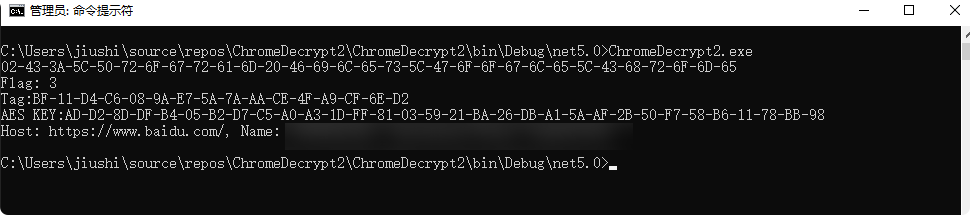

# ChromeV20Decrypt
chrome v20 Decrypt

GPT翻译自:https://github.com/runassu/chrome_v20_decryption/blob/main/decrypt_chrome_v20_cookie.py  
纯Demo，实战还是用不了

## 原理 ##
1.打开Local State匹配app_bound_encrypted_key  
2.SYSTEM用户权限dpapi解密  
3.当前用户权限dpapi解密  
3.根据结构体的flag来判断，使用不同的方式解密  
    1.从elevation_service.exe里获取私钥 AES GCM解密得到解密需要用的AES KEY(MastKEY)  
    2.从elevation_service.exe里获取私钥 ChaCha20解密得到解密需要用的AES KEY(MastKEY)  
    3.从elevation_service.exe里获取XOR Key  
        1.SYSTEM用户解密当前结构体的AES KEY  
        2.解密后在用XOR KEY异或解密  
        3.XOR异或解密后AES GCM解密得到解密需要用的AES KEY(MastKEY)  
4.从sqlite db中提取从要解密的内容，判断开头是否为v20，划分出IV、TAG，使用MastKEY进行AES GCM解密  

## 环境需求: ##
- .NET Core 5.0 (.NET Core 5.0才开始支持AES GCM加密)
- System.Data.SQLite依赖

